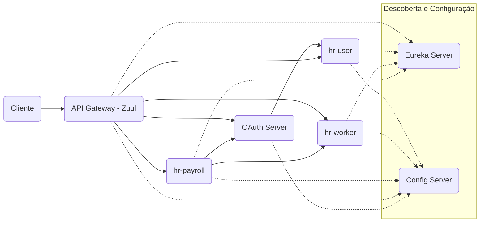

# ☕ Microsserviços Java com Spring Boot e Spring Cloud

[](./LICENSE)
[](https://adoptium.net/)
[](https://spring.io/projects/spring-boot)
[](https://www.docker.com/)
[](https://github.com/Jacques-Trevia/ms-course/blob/main/LICENSE)

## 📖 Sobre o Projeto

Este repositório contém a implementação prática de uma arquitetura de **microsserviços** completa utilizando o ecossistema **Spring Boot** e **Spring Cloud**. O projeto foi desenvolvido como parte do curso de Microsserviços com Spring Boot e Spring Cloud do professor Nélio Alves (Udemy).

A principal proposta é demonstrar os principais padrões e soluções para construir sistemas distribuídos robustos, escaláveis e resilientes, indo além do desenvolvimento de APIs monolíticas.

## 🏗️ Arquitetura do Sistema

A arquitetura é composta pelos seguintes componentes:

*   **Service Discovery (Eureka Server)**: Permite que os microsserviços se encontrem dinamicamente, sem endereços fixos.
*   **Config Server**: Centraliza e gerencia as configurações externas de todos os microsserviços a partir de um repositório Git.
*   **API Gateway (Zuul)**: Atua como a porta de entrada única para o sistema, lidando com roteamento, autenticação inicial e cross-cutting concerns.
*   **OAuth Server**: Serviço centralizado para autenticação e autorização, emitindo tokens JWT para acesso seguro aos recursos.
*   **Microsserviços de Negócio**: Conjunto de pequenos serviços (`hr-user`, `hr-worker`, `hr-payroll`) cada um com sua própria responsabilidade e banco de dados.

### Diagrama de Fluxo Simplificado



🚀 Tecnologias Utilizadas
Java 17

Spring Boot 2.7.x

Spring Cloud (Netflix): Eureka, Zuul, OpenFeign, Config Server

Spring Security & OAuth2: Autenticação e autorização com JWT

Spring Data JPA / Hibernate

H2 Database (para desenvolvimento) e PostgreSQL

Maven

Docker e Docker Compose: Orquestração de containers

GitHub Actions (para possíveis pipelines de CI/CD)

📂 Estrutura do Projeto
O repositório é organizado em módulos Maven independentes, um para cada serviço:

```
ms-course/
├── hr-api-gateway-zuul/      # Porta de entrada (Gateway)
├── hr-config-server/          # Servidor de configuração centralizada
├── hr-eureka-server/          # Servidor de descoberta (Service Discovery)
├── hr-oauth/                  # Serviço de autenticação OAuth2
├── hr-payroll/                # Microsserviço de processamento de folha
├── hr-user/                   # Microsserviço de gerenciamento de usuários
├── hr-worker/                 # Microsserviço de gerenciamento de trabalhadores
├── postman/                   # Coleção e variáveis de ambiente do Postman
└── docker-compose.yml        # Orquestração de todos os containers
```

▶️ Como Executar o Projeto
Pré-requisitos
Java 17 instalado

Docker e Docker Compose instalados

Git (para clonar o repositório)

Passo a Passo
Clone o repositório:

bash
```
git clone https://github.com/Jacques-Trevia/ms-course.git
cd ms-course
```
Build de todas as imagens Docker (recomendado):
Navegue até a pasta de cada serviço (ex: cd hr-eureka-server) e execute:

bash
```
mvn clean package
docker build -t jacquestrevia/hr-eureka-server:latest .
```
(Repita para cada serviço ou crie um script para automatizar)

Execute a aplicação com Docker Compose:
Na raiz do projeto, onde está o arquivo docker-compose.yml, execute:

bash
```
docker-compose up -d
```

Acesse os serviços:

Eureka Dashboard: http://localhost:8761

API Gateway: http://localhost:8765

Config Server (endpoint de exemplo): http://localhost:8888/hr-payroll/default

Teste os Endpoints:

Importe a coleção do Postman que está na pasta postman/.

Configure a variável de ambiente base_url com http://localhost:8765 (Gateway).

Faça uma requisição POST para /oauth/token para obter um token JWT.

Use o token para acessar os endpoints protegidos (ex: GET /payroll/1).

---

## 📜 Licença

Este projeto é parte do curso da udemy **Microsserviços Java com Spring Boot e Spring Cloud** e tem propósito educacional.

---

## 👨‍💻 Autor

**Jacques Araujo Trevia Filho**

[](https://www.linkedin.com/in/jacques-trevia)
[](https://github.com/Jacques-Trevia)
