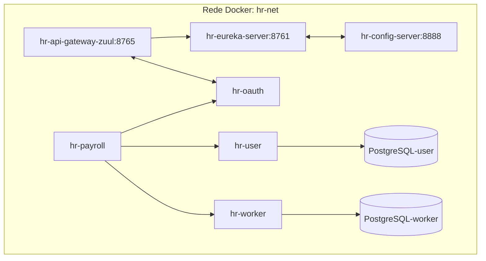

# 🐳 Microsserviços com Docker - Branch docker

[](./LICENSE)
[](https://www.docker.com/)
[](https://docs.docker.com/compose/)

> ⚠️ **Branch específica para execução com Docker**  
> Esta branch contém a versão **containerizada** de todos os microsserviços, com cada serviço rodando em seu próprio container e utilizando **PostgreSQL** como banco de dados.

## 🎯 Diferenças entre `main` e `docker`

| Característica | Branch `main` | Branch `docker` (esta) |
| :--- | :--- | :--- |
| **Execução** | Maven/Java direto na máquina | Docker containers |
| **Banco de dados** | H2 (em memória) | PostgreSQL (persistente) |
| **Configuração** | Manual, serviço por serviço | Automatizada via `docker-compose` |
| **Perfil Spring** | `default` ou `test` | `dev` (com suporte a Docker/Postgres) |
| **Ideal para** | Desenvolvimento local rápido | Testes integrados, homologação, produção |

## 🏗️ Arquitetura Containerizada

Todos os serviços foram adaptados para rodar em containers Docker isolados, mas conectados em rede:


## 📦 Containers Disponíveis

| Container | Porta | Banco de Dados | Descrição |
| :--- | :--- | :--- | :--- |
| `hr-eureka-server` | 8761 | - | Service Discovery |
| `hr-config-server` | 8888 | - | Configurações centralizadas |
| `hr-api-gateway-zuul` | 8765 | - | API Gateway (roteamento) |
| `hr-oauth` | - | - | Autenticação OAuth2/JWT |
| `hr-user` | - | PostgreSQL-user | Microsserviço de usuários |
| `hr-worker` | - | PostgreSQL-worker | Microsserviço de trabalhadores |
| `hr-payroll` | - | - | Microsserviço de folha de pagamento |

## 🚀 Como Executar Tudo com Docker

### Pré-requisitos

- **Docker** e **Docker Compose** instalados
- **Git** (para clonar a branch específica)

### Passo a Passo

1. **Clone a branch `docker`**:
   ```bash
   git clone -b docker https://github.com/Jacques-Trevia/ms-course.git
   cd ms-course
Configure as variáveis de ambiente (se necessário):

# Para o Config Server acessar seu repositório privado
export GITHUB_USER=Jacques_Trevia
export GITHUB_PASS=seu_token_ou_senha
Inicie todos os serviços com Docker Compose:

bash
 ```
docker-compose up -d
 ```
Verifique se todos os containers estão rodando:

bash
 ```
docker ps
 ```
Você deve ver 7+ containers com status Up.

Acesse os serviços:

Eureka Dashboard: http://localhost:8761

API Gateway: http://localhost:8765

Config Server (exemplo): http://localhost:8888/hr-payroll/default

🛠️ Comandos Úteis para Gerenciar os Containers

# Ver logs de um serviço específico
docker logs -f hr-eureka-server

# Parar todos os serviços
docker-compose down

# Parar e remover volumes (limpa bancos de dados)
docker-compose down -v

# Reiniciar um serviço específico
docker-compose restart hr-user

# Executar comando em um container rodando
docker exec -it hr-user bash

# Ver a rede criada
docker network inspect hr-net
🗄️ Bancos de Dados PostgreSQL
Cada microsserviço que precisa de persistência tem seu próprio banco PostgreSQL em container separado:

# Conectar ao banco do hr-user
docker exec -it postgres-user psql -U postgres -d dbuser

# Comandos úteis dentro do PSQL
 ```
\l          # listar databases
\dt         # listar tabelas
\q          # sair
 ```
🔧 Configuração do Perfil dev
Os serviços utilizam o perfil Spring dev, que está configurado para:

Conectar ao PostgreSQL (em vez do H2)

Buscar configurações do Config Server

Registrar-se no Eureka Server

📝 Testando a Aplicação
Importe a coleção do Postman (pasta postman/)

Configure a variável base_url = http://localhost:8765

Obtenha um token:

POST http://localhost:8765/oauth/token
Authorization: Basic ... (conforme curso)
Acesse endpoints protegidos:

GET http://localhost:8765/payroll/1
Authorization: Bearer SEU_TOKEN_AQUI

### 🐛 Troubleshooting

**Porta 8888 já em uso**

# Descubra o processo usando a porta
 ```
netstat -ano | findstr :8888
 ```

# Mate o processo (substitua PID pelo número)
 ```
taskkill /PID 1234 /F
 ```

# Verifique os logs do container específico
 ```
docker logs hr-config-server
docker logs hr-eureka-server
 ```

# Config Server não conecta

Confirme as variáveis de ambiente GITHUB_USER e GITHUB_PASS

Verifique se o token/senha está correto

Teste se o repositório é acessível publicamente

Banco de dados vazio

# Conecte ao PostgreSQL e execute scripts

 ```
docker exec -it postgres-user psql -U postgres -d dbuser -f /caminho/do/script.sql
 ```

📂 Estrutura da Branch
 ```
ms-course/
├── hr-api-gateway-zuul/
│   └── Dockerfile
├── hr-config-server/
│   └── Dockerfile
├── hr-eureka-server/
│   └── Dockerfile
├── hr-oauth/
│   └── Dockerfile
├── hr-payroll/
│   └── Dockerfile
├── hr-user/
│   ├── Dockerfile
│   └── application-dev.properties (configuração PostgreSQL)
├── hr-worker/
│   ├── Dockerfile
│   └── application-dev.properties (configuração PostgreSQL)
├── postman/
│   └── (coleção de testes)
├── docker-compose.yml          # Orquestração completa
└── README.md                    # Este arquivo
 ```

---

## 📜 Licença

Este projeto é parte do curso da udemy **Microsserviços Java com Spring Boot e Spring Cloud** e tem propósito educacional.

---

## 👨‍💻 Autor

**Jacques Araujo Trevia Filho**

[](https://www.linkedin.com/in/jacques-trevia)
[](https://github.com/Jacques-Trevia)
